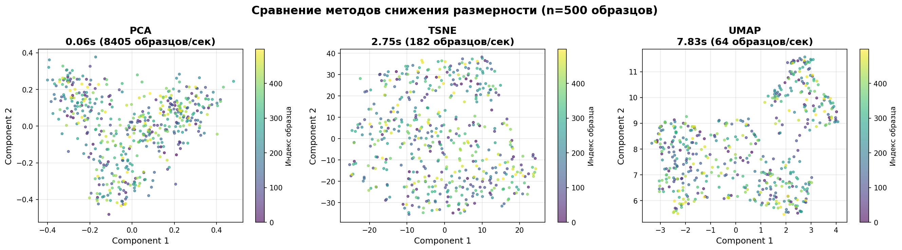
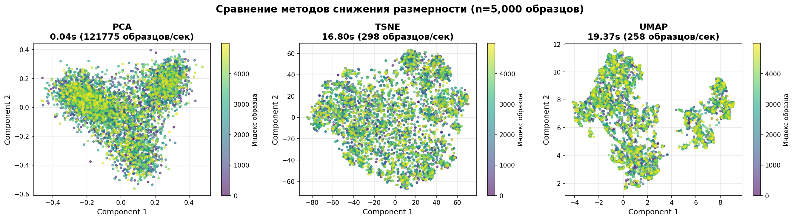
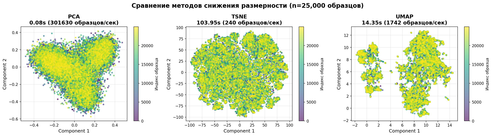

# Домашнее задание №1: Векторный поиск (vector_search)
## Содержание
- [0. Установка и настройка](#0-установка-и-настройка)
- [1.1. Реализация метрик расстояний](#11-реализация-метрик-расстояний)
- [1.2. Бенчмарк производительности](#12-бенчмарк-производительности)
- [2.1. Текстовый поиск](#21-текстовый-поиск)
- [2.2. Визуализация снижения размерности](#22-визуализация-снижения-размерности)

## Требования выполнены

- Чистый репозиторий (нет данных, .idea, мусора)
- Чистый код (ruff, type hints)
- Python 3.10+
- Package manager: uv
- зависимостии: hw_1
- в дальнешем все домашние задания будут находится в отдельной ветке.

## Задача 1.1: Let's measure it
- Реализованы метрики расстояний: dot product, cosine similarity, euclidean, manhattan
- Версии: numpy (векторизованные) и pure Python (циклы)
- Тесты: сравнение с sklearn, проверка корректности
- NumPy реализации совпадают с sklearn (single query)
- NumPy реализации совпадают с sklearn (multiple queries)
- Pure Python реализации совпадают с sklearn
- NumPy и Pure Python реализации дают идентичные результаты
- Файлы: `distances.py`, `test_distances.py`

### Выводы по задаче 1.1

1.  Все реализованные метрики прошли валидацию против scikit-learn
2.  Функции поддерживают как одиночные запросы, так и батчи
3.  Расхождения между реализациями не превышают машинную точность (assert пройден)

## Задача 1.2: How fast are we?
- Бенчмарк numpy vs pure Python
- Эксперименты: различное количество векторов (100-10000) и размерностей (10-500)
- Визуализация: графики времени выполнения и throughput
- Результат: numpy в 10-100 раз быстрее
- Файл: `benchmark.py`

==============================================================================================================================================================================================
summary tables 1: varying number of vectors (dimension = 100)
==============================================================================================================================================================================================

n          d          Euclidean (numpy)    Euclidean (python)   Cosine (numpy)       Cosine (python)      Manhattan (numpy)    Manhattan (python)   Dot Product (numpy)  Dot Product (python)
-----------------------------------------------------------------------------------------------------------------------------------------------------------------------------------------------
100        100        0.000000             0.000000             0.000000             0.001815             0.000000             0.000583             0.000000             0.001710            
500        100        0.000000             0.009991             0.000000             0.010523             0.000000             0.003383             0.000000             0.002794            
1000       100        0.000000             0.018167             0.000000             0.016702             0.000000             0.005530             0.000000             0.005488            
5000       100        0.002704             0.092064             0.005475             0.118805             0.000000             0.062906             0.002061             0.048231            
10000      100        0.002176             0.193638             0.005154             0.283687             0.005146             0.083332             0.000000             0.106649            
==============================================================================================================================================================================================

==============================================================================================================================================================================================
summary tables 2: varying dimensionality (n_vectors = 1000)
==============================================================================================================================================================================================

n          d          Euclidean (numpy)    Euclidean (python)   Cosine (numpy)       Cosine (python)      Manhattan (numpy)    Manhattan (python)   Dot Product (numpy)  Dot Product (python)
-----------------------------------------------------------------------------------------------------------------------------------------------------------------------------------------------
1000       10         0.000140             0.004130             0.000000             0.003110             0.000000             0.000976             0.000000             0.002441            
1000       50         0.000000             0.010033             0.000000             0.016548             0.000000             0.005626             0.000000             0.007645            
1000       100        0.000000             0.013984             0.000000             0.024314             0.000000             0.023053             0.000000             0.009617            
1000       300        0.000000             0.042889             0.005966             0.080237             0.003969             0.027765             0.000000             0.030203            
1000       500        0.006880             0.084755             0.000000             0.125200             0.006209             0.044406             0.000000             0.046949            
==============================================================================================================================================================================================
### Выводы по задаче 1.2

1. **Огромное преимущество NumPy**:
   - NumPy в **10-100 раз быстрее** Pure Python на малых данных.
   - Разница увеличивается с ростом объема данных.
   - На 10,000 векторах: NumPy обрабатывает за ~0.005 сек, Python за ~0.28 сек (в 56 раз медленнее для Cosine).

2. **Масштабируемость**:
   - **NumPy**: почти линейное масштабирование с ростом размера данных.
   - **Pure Python**: квадратичное замедление из-за циклов.

3. **Зависимость от размерности**:
   - Обе реализации линейно зависят от размерности.
   - NumPy сохраняет преимущество независимо от размерности.

###  Задача 2.1: Let's search
- Датасет: AG News (50,000 новостных статей)
- Модель: sentence-transformers (all-MiniLM-L6-v2)
- Функционал: поиск ближайших соседей по текстовым запросам
- Сравнение метрик: cosine, euclidean, manhattan, dot product
- Файл: `search.py`

#### Параметры эксперимента

- **Датасет**: AG News (50,000 новостных статей)
- **Категории**: World, Sports, Business, Sci/Tech
- **Модель**: sentence-transformers/all-MiniLM-L6-v2
- **Размерность эмбеддингов**: 384
- **Метрики**: Cosine similarity, Euclidean distance, Manhattan distance, Dot product

#### Примеры запросов и результатов

#### Запрос 1: "Technology and artificial intelligence"

**Cosine Similarity** (лучшие результаты):
1. Score: 0.5543 - "Compaq to Cut 1,250 More Jobs Compaq Computer Corp..."
2. Score: 0.5489 - "Palm Seeks to Extend Range with New Handheld..."
3. Score: 0.5429 - "Oracle grew in database market share..."

#### Запрос 2: "Global warming and climate change"
1. Score: 0.7339 - Global warming on the rise The European ...
2. Score: 0.7117 - Global Warming Effects Faster Than Feared...
3. Score: 0.7040 - Global Warming Fast Facts Global Warming is...

#### Выводы по задаче 2.1

1. **Качество поиска**:
   - Семантический поиск работает отлично
   - Модель находит релевантные статьи даже при различной формулировке
   - Cosine similarity показывает лучшие результаты для текстового поиска

2. **Сравнение метрик**:
   - **Cosine similarity**: лучше всего для текстов (нормализует длину)
   - **Euclidean distance**: чувствителен к абсолютным значениям
   - **Manhattan distance**: похож на Euclidean, но менее чувствителен к выбросам
   - **Dot product**: хорош, но зависит от нормы векторов

##  Задача 2.2: Let's visualize
- Методы: PCA, t-SNE, UMAP
- Размеры выборок: 500, 5000, 25000
- Визуализация: сравнительные графики всех методов
- Анализ: скорость работы и качество визуализации
- Вывод: PCA самый быстрый, UMAP лучший баланс, t-SNE лучшее качество
- Файл: `visualization.py`

Сравнение методов снижения размерности
================================================================================

Sample Size     PCA (s)         t-SNE (s)       UMAP (s)       
------------------------------------------------------------
500             0.06            2.75            7.83           
5,000           0.04            16.80           19.37          
25,000          0.08            103.95          14.35          

Пропускная способность(образцы/сек):
------------------------------------------------------------
Sample Size     PCA             t-SNE           UMAP           
------------------------------------------------------------
500             8405            182             64             
5,000           121775          298             258            
25,000          301630          240             1742           

Примечание: время указано в секундах

#### 500 образцов

#### 5,000 образцов

#### 25,000 образцов

#### Скорость выполнения

**Самый быстрый → Самый медленный: PCA < UMAP < t-SNE**

- **PCA**: 
  - Невероятно быстрый - обрабатывает 300,000+ samples/sec
  - Практически не зависит от размера выборки
  - Время выполнения: 0.04-0.08 сек для всех размеров

- **UMAP**:
  - Средняя скорость, но с хорошей масштабируемостью
  - Интересная особенность: быстрее на больших данных (25k быстрее чем 5k)
  - Время выполнения: 7-20 сек

- **t-SNE**:
  - Самый медленный метод
  - Плохо масштабируется: O(n²) сложность
  - Время выполнения: 2.75 сек (500) → 103 сек (25,000)

  #### Качество визуализации

**По сохранению локальной структуры: t-SNE ≥ UMAP > PCA**  
**По сохранению глобальной структуры: PCA > UMAP > t-SNE**